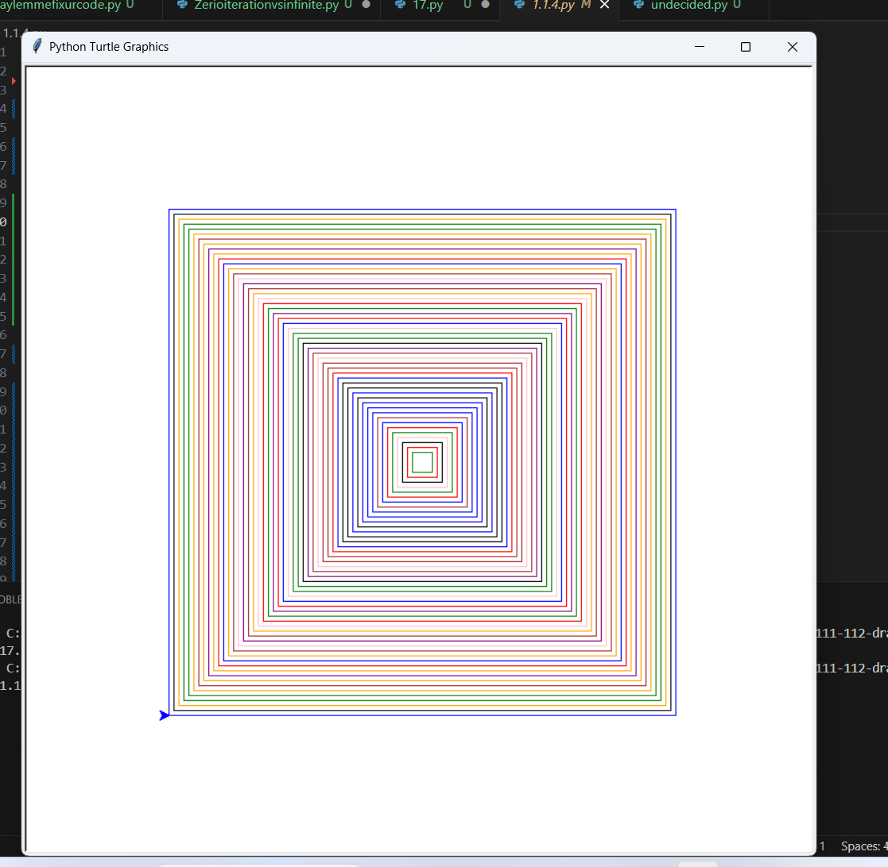

# 1.1.4Spirographs

# Code Screenshots 

Question 1

Zero-iteration conditions occur when a loop's condition is false from the start so it wont run. Infinite loops happen when a loop's condition is always true which means it runs forever.

Question 2 

## My Python Program

